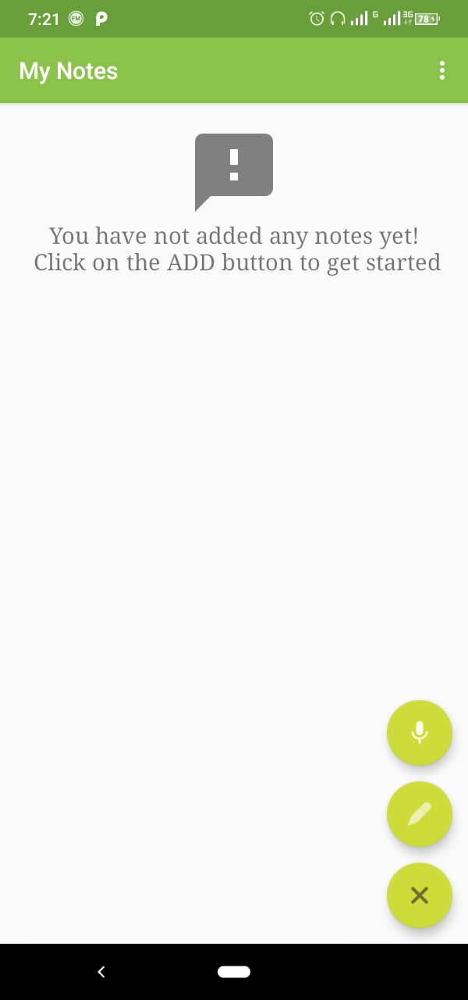
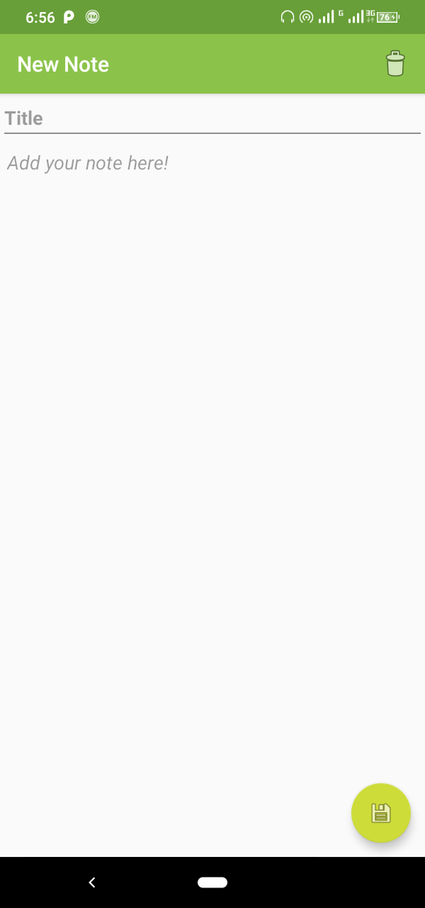
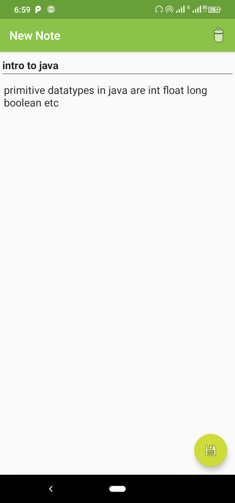
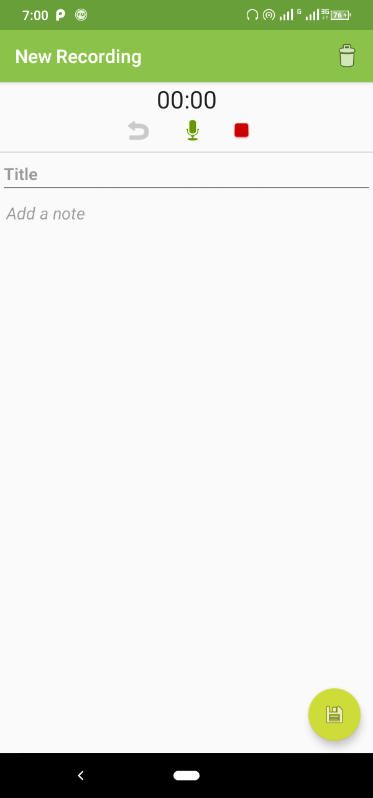
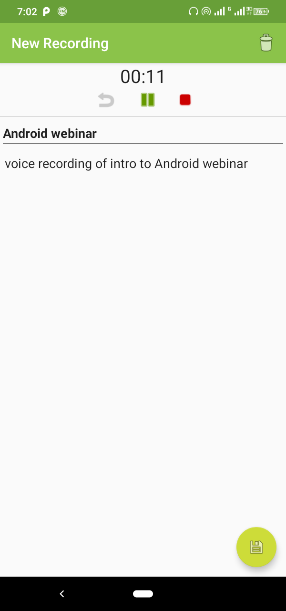
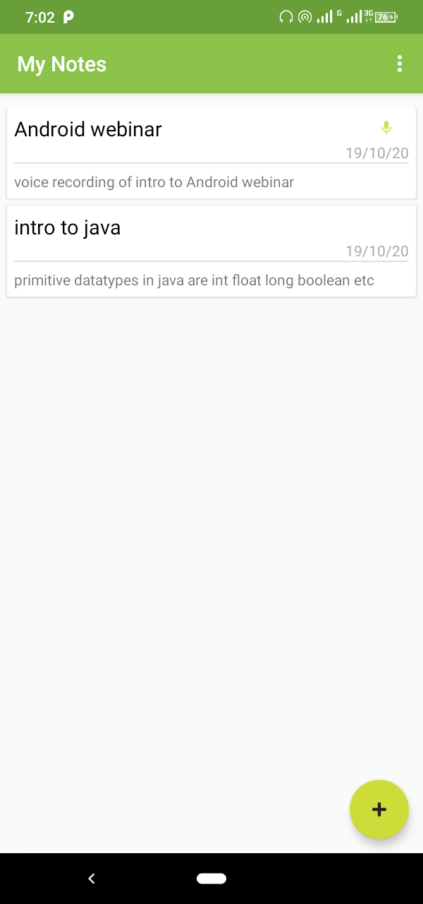
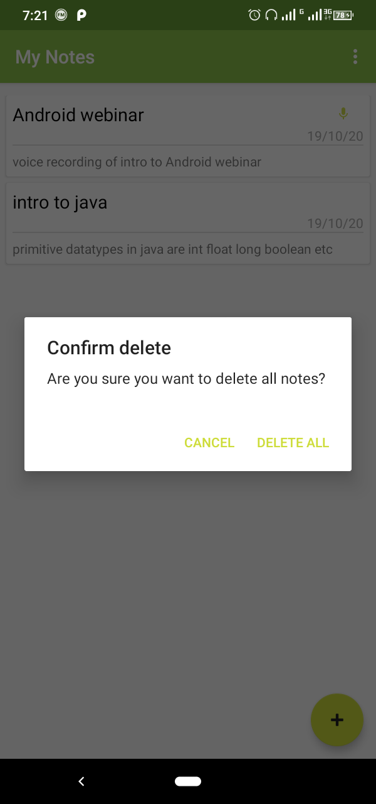

# My-Notes-App

Notes keeping app. You can also store voice recordings in the app.

## Demo

|                    Starting screen                     |                       Add Note                        |                    Edit note                     |
| :----------------------------------------------------: | :---------------------------------------------------: | :----------------------------------------------: |
|   |      |  |
|                 Start voice recording                  |                      Edit record                      |                    Your data                     |
|  |  |   |
|                      Delete data                       |
|           |
